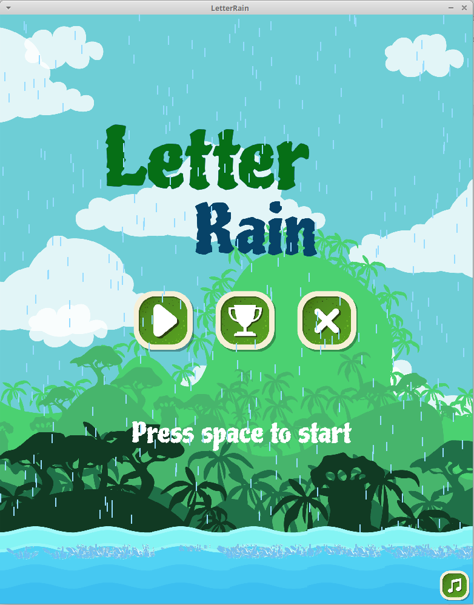
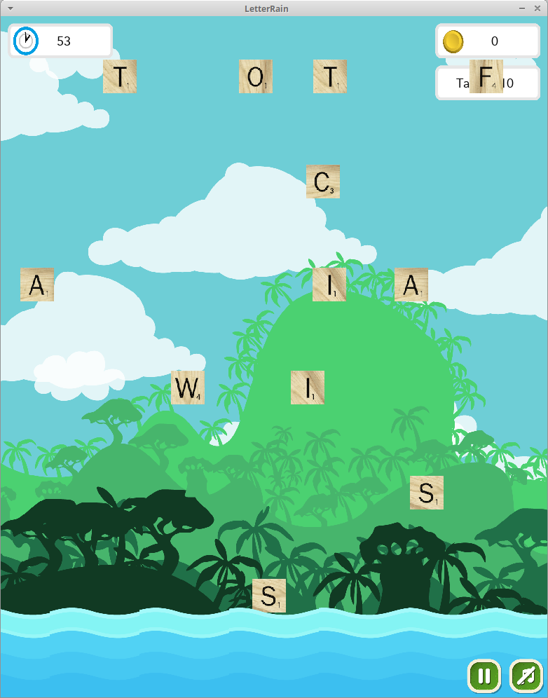
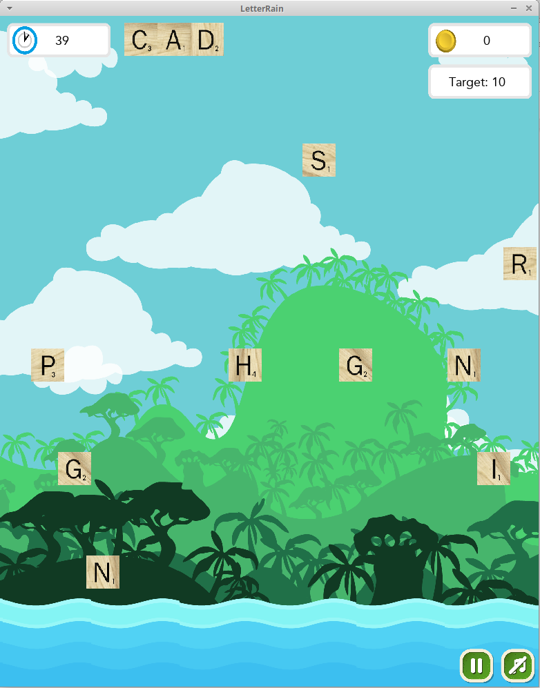
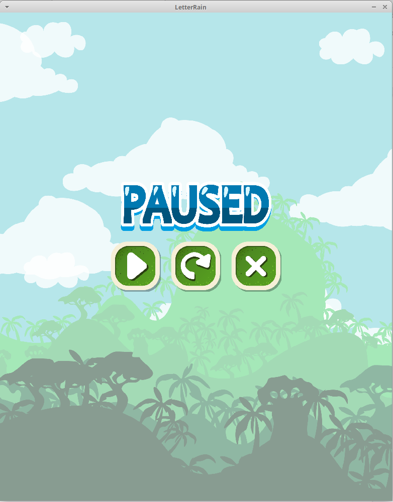
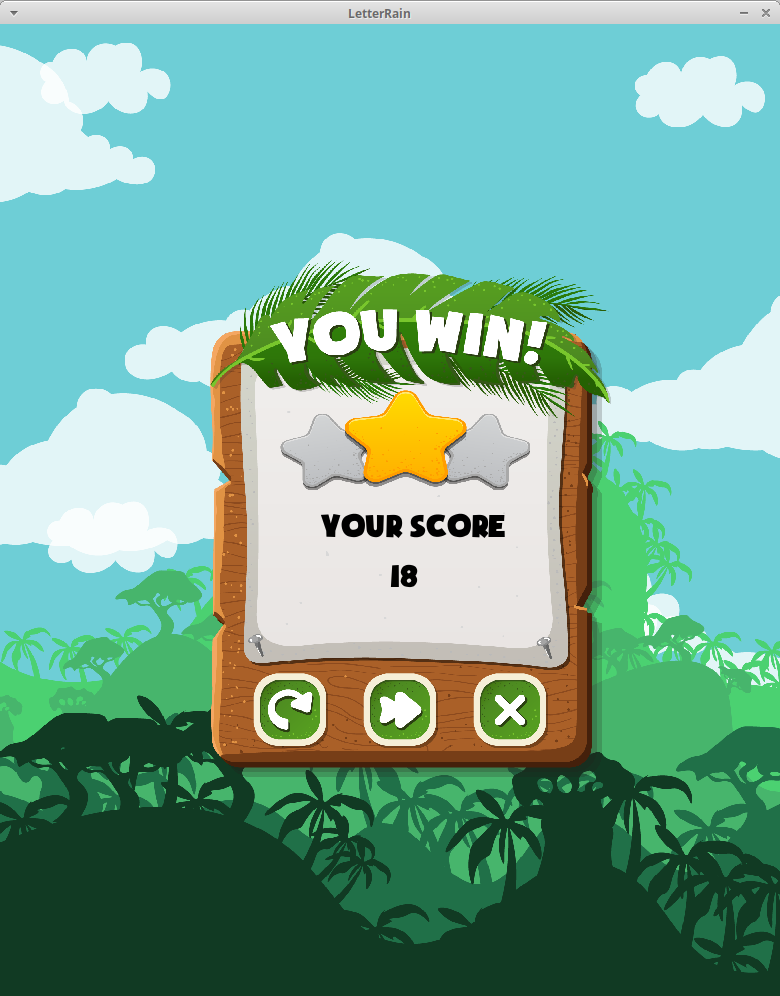
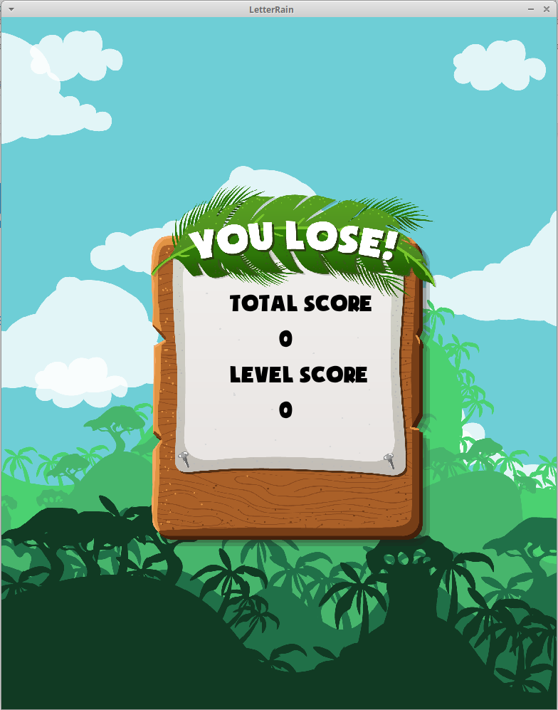
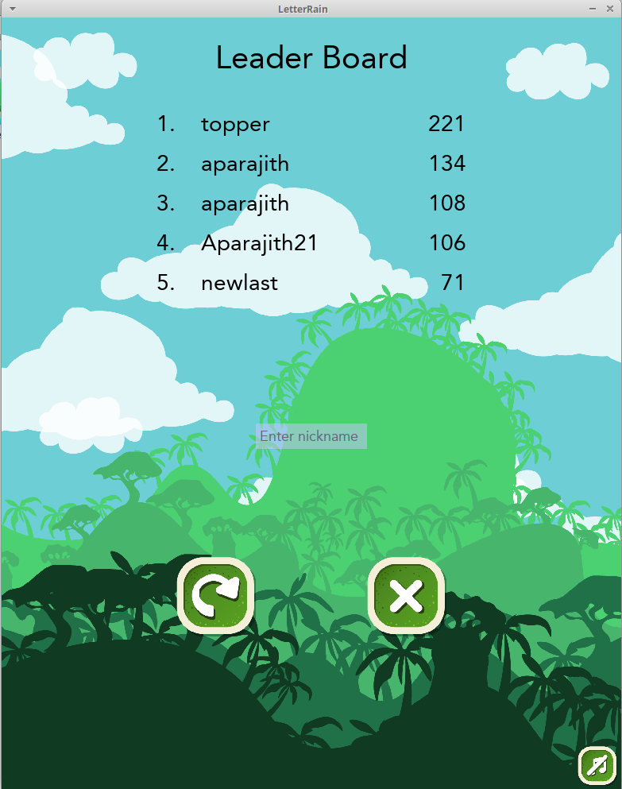

# Letter Rain - An Interactive Letter Game


Letter Rain is an original interactive PC game developed using the
PyGame library. The game tests your focus and vocabulary by challenging
you to form words from the falling letters before they sink into the
water below. Speed and accuracy are key factors to excel in this game,
apart from of course, the slice of luck.

## Usage
```python3 game.py```

## Tools Used

-   Python3
-   Pygame

## Gameplay

The gameplay is very simple and intuitive. There will be letters falling
from the sky into the river below. The objective of the game is to form
meaningful words from those letters before it falls into the river and
score points. The player can form words by pressing the key in the
keyboard corresponding to the falling letter. Once a player is satisfied
with the word formed, they can press Return on the keyboard for score
counting and then to continue with the next word. At each level, there
is a predefined target score that the player must achieve in order to
progress to the next level. Each level is of the same  fixed duration
(defined by LVL\_TIMEOUT) of 1 minute. Within this duration the player
must achieve a minimum of the target score to progress. Failing to score
the minimum level target score will lead to  “Game Over”.

## Features

-   Pause - The player can decide to pause the game at any point in
    between the level. A pause screen with three options - continue,
    restart and quit, appear on the screen.
-   Music - The game has a background track running in order to make it
    more interesting. The current background music track is the famous
    piano piece, “Clair De Lune”. The player can choose to mute the
    background music at any point during the game. There is a button in
    the right hand bottom corner to mute/unmute the audio.
-   Restart - As mentioned in the pause feature explanation, the player
    can choose to restart the game at any point during the game by
    pausing it and pressing on the restart button. The player also has
    the option to restart even after “Game Over” from the leaderboard.
-   Level Countdown - Before the start of each level, there is a
    countdown timer for 3 seconds which notifies the player that the
    game is about to start.
-   Level Scores - After each level a scoreboard is displayed which
    tells the player if he/she has won or lost the level. In case the
    player has won the level, the scoreboard also displays the rating in
    terms of stars. We have explained more about rating in the Scores &
    Rating section. A player can also choose to restart the same level
    if they want to improve their score.
-   Leaderboard - After “Game Over” the player is directed to the
    leaderboard window where they can view the leaders of the game. They
    can enter their name in the textbox given and see if they have made
    it among the leaders.
-   Display of Words Formed

## Levels

At the moment there are 10 leves with the target scores of 10, 20, 30,
40, 50, 60, 65, 70, 75 and 80 respectively. Each level is of a fixed
duration of 1 minute within which the player has to score a minimum
target score. Even after scoring the minimum target score, the level
continues until time runs out during which the player can score
additional points with the intent of achieving  a high score.

Each level begins with a screen displaying the level number followed by
a countdown for 3 seconds. This gives the player time to get ready for
the upcoming level.

Each level has 3 header informations - time remaining, level score and
the target score for the current level. The level screen also displays
the word being formed in the top center of the screen.

The level window also has buttons to mute/unmute the background music
and also pause the game.

## Letter Generation

The letters are generated from a distribution that ensures a high
probability of being able to form a meaningful word.

The distribution was created using a dictionary. For every word in the
dictionary and for every position - with position defined to be the
letter position when counting from the left, for instance, for the word
‘example’, x is the letter in position 2 - the frequency of each letter
for every position for 15 positions (assuming the largest word that can
be formed in this game is 15 letter long) is found.

We sample randomly from this distribution to generate letters.

For instance, if 5 letters are asked at a time, we sample 1 letter from
the distribution of the first position, one from the second, one from
the third and so on, so that there is a good chance of a 5 letter word
being possibly formed.

The algorithm to generate this can possibly be improved in the future,
but this is what it is for now.

## Scores & Rating

The scoring for this game is similar to the one used in scrabble. Each
letter has  a score associated with it. The score for each letter is
also taken from Scrabble. If the player forms a meaningful word (that is
present in our dictionary), we compute the sum of the scores of the
individual letter in the word and update the score.

## Rating

The player gets the rating only if they pass the level by scoring the
minimum target score. The rating is done in a simple manner as follows:

-   Level score \< min(2 \* Minimum Target score for the Level, Target
    Score + 10)  - 1 star
-   Level score \< min(3 \* Minimum Target score for the Level, Target
    Score + 20) - 2 stars
-   Level score ≥ min(3 \* Minimum Target score for the Level, Target
    Score + 20)  - 3 stars

Look into the Game

## Start Screen



### Level Screen



### Level Screen - Word Formed



### Pause Screen



Score Screen

### Game Over Screen



Leaderboard


